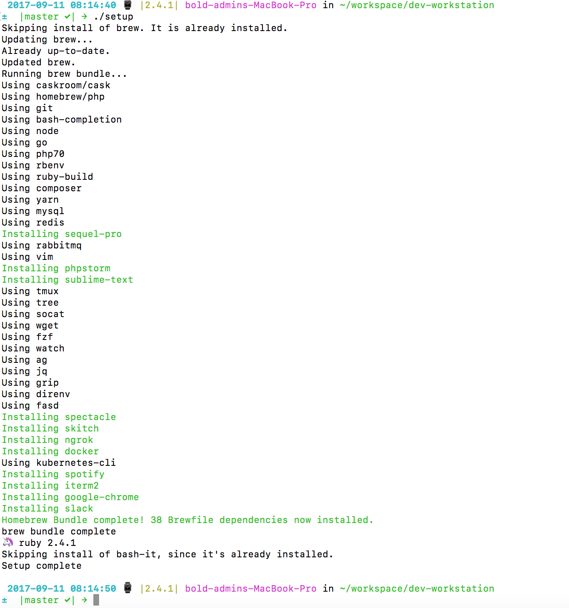

# dev-workstation
Setting up an macOS dev workstation 💻 ?

This script can be used to setup a new laptop, however we are also looking to update these scripts so that they are idempotent and can be used to update workstations.
Also looking to make it so that supports bash and zsh users.

*Note: This has been tested as of macOS High Sierra 10.13.3*

## Pre-requisites
```
git clone https://github.com/bold-commerce/dev-workstation.git
```

## Install
```
./setup
```

**Example output:**



## What do we use?
The installation uses a [Brewfile](Brewfile) of packages and a few scripts.

### Version control
- [git](https://git-scm.com/)
- [git-crypt](https://www.agwa.name/projects/git-crypt/)

### Shell
- [bash-it](https://github.com/Bash-it/bash-it)
- [bash-completion](https://github.com/scop/bash-completion)

### Terminal
- [iterm2](https://www.iterm2.com/)

### Languages
- [php](https://php.net)
- [go](https://golang.org)
- [node](https://nodejs.org)
- [ruby](https://www.ruby-lang.org/en/)

### Editors/IDE
- [phpstorm](https://www.jetbrains.com/phpstorm/)
- [vim](http://vim-bootstrap.com/)
- [sublime](http://sublimetext.com)
- [vscode](https://code.visualstudio.com/)
- [nano](https://www.nano-editor.org/)

### Package managers
- [composer](https://getcomposer.org/)
- [npm](https://npmjs.org)
- [yarn](https://yarnpkg.com/en/)

### Databases
- [mysql](https://www.mysql.com)
- [redis](https://redis.io/)

## Messaging
- [rabbitmq](https://www.rabbitmq.com/)

## Containers
- [docker](https://www.docker.com)
- [kubernetes-cli](https://kubernetes.io/)

### Utilities
- [tmux](https://robots.thoughtbot.com/a-tmux-crash-course) terminal multiplexer (windows for terminals)
- [tree](https://linux.die.net/man/1/tree)
- [wget](https://www.gnu.org/software/wget/)
- [fzf](https://github.com/junegunn/fzf)
- [fasd](https://github.com/clvv/fasd)
- [watch](https://www.tutorialspoint.com/unix_commands/watch.htm)
- [ag](https://github.com/ggreer/the_silver_searcher) Like grep but better
- [jq](https://stedolan.github.io/jq/) working with json
- [grip](https://github.com/joeyespo/grip) local Markdown viewer
- [direnv](https://direnv.net/) Automatically load/unload env vars
- [socat](https://linux.die.net/man/1/socat)
- [spectacle](https://www.spectacleapp.com/) Organize windows in OSX without a :mouse:
- [skitch](https://evernote.com/products/skitch) When you need screenshots
- [ngrok](https://ngrok.com/) Secure tunnel to localhost
- [tig](https://jonas.github.io/tig/) Text mode interface for git
- [gpg-suite](gpg-suite) GPG Keychain

### Music
- [spotify](https://www.spotify.com/ca-en/)

### Web
- google-chrome
- slack


## Troubleshooting
To ensure `vim` works properly with `git` commit messages, add the following to your `.bash_profile` or `.zshrc`:
```
export EDITOR=vim
```
